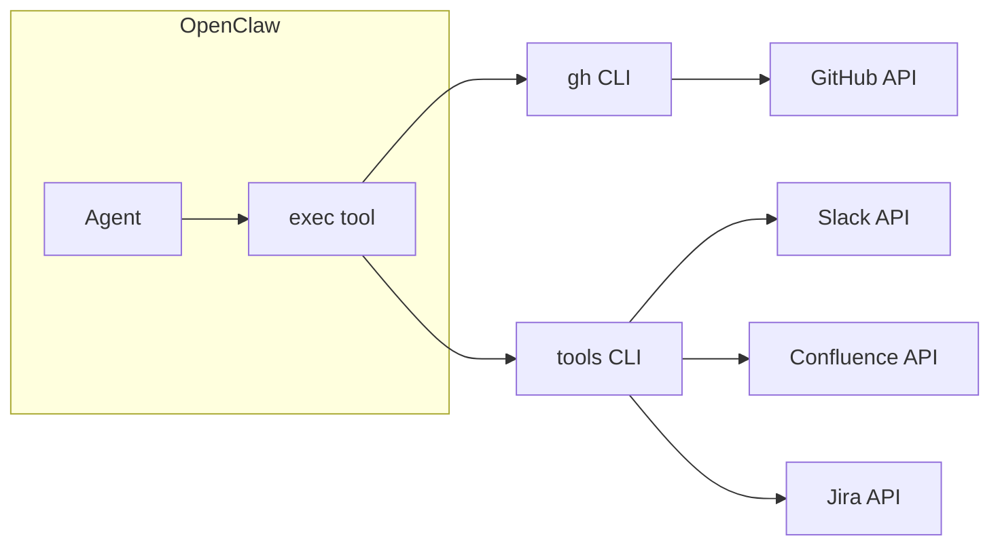

# Slack / Confluence / Jira / GitHub 読み取り・書き込み — 実装プラン

再開時はこのファイルを参照して実装を続行する。**採用方針: 案A（Skills 中心）**。**書き込みはユーザーに許可を求め、承認されたときのみ実行する**。

---

## 現状の整理

| サービス | OpenClaw 標準 | 読み取りの現状 | 書き込み |
|----------|----------------|----------------|----------|
| **Slack** | チャネル連携 + `slack` ツール | メッセージ取得・検索・スレッド等はスキルで対応 | 投稿・編集・リアクション等をスキルで対応（要ユーザー承認） |
| **Confluence** | なし | REST API でスキル対応 | ページ作成・更新をスキルで対応（要ユーザー承認） |
| **Jira** | なし | REST API でスキル対応 | issue 作成・更新・コメントをスキルで対応（要ユーザー承認） |
| **GitHub** | なし（標準ツールなし） | 既存スキル `github` が `gh` CLI で読み取り可能 | issue/PR 作成・コメント・マージ等をスキルで対応（要ユーザー承認） |

- **Skills**: `config/workspace/skills/` または `~/.openclaw/skills` に SKILL.md + 必要なら scripts/references。エージェントが「いつ・どう使うか」を学習し、既存ツール（exec, gateway, web_fetch 等）や外部 CLI を呼ぶ。
- **MCP**: 既存の `mcporter` スキルで MCP サーバーを呼べる。`mcporter call <server.tool>` でツール実行。設定は `config/mcporter.json`（または `--config`）でサーバー定義。
- **組み込みツール**: `slack`（reactions/messages/pins/memberInfo/readMessages）、`web_fetch`、`exec` 等。

---

## 案A: Skills 中心（REST API + 既存ツール） — 採用

**GitHub** は既存スキル（`gh` CLI）を利用。**Slack / Confluence / Jira** はリポジトリトップの **`tools/`** 配下の TypeScript CLI をバンドルし、スキルから `exec` で呼ぶ（組み込み slack ツールには依存しない）。

- **Slack**: 新規スキル（例: `slack-read`）。**読み**: チャンネル一覧・メッセージ取得・検索・スレッド・履歴。**書き**: メッセージ投稿・編集・削除・リアクション・ピン等。実行は `tools/` の Slack 用 CLI（`node .../slack-cli.js`）を呼ぶ。書き込みは「実行前に内容をユーザーに提示し、明示的に承認されてからのみ実行」と SKILL.md に記載。
- **GitHub**: 既存スキル `github`（`gh` CLI）を拡張。**読み**: issues/PR 一覧・詳細・CI ログ・`gh api`。**書き**: issue/PR 作成・コメント・ラベル・マージ等。書き込みは同上、ユーザー承認後にのみ実行と SKILL.md に記載。
- **Confluence**: 新規スキル（例: `confluence-read`）。**読み**: ページ取得・検索・CQL。**書き**: ページ作成・更新・コメント。実行は `tools/` の Confluence 用 CLI。書き込みは同上、ユーザー承認後にのみ実行。
- **Jira**: 新規スキル（例: `jira-read`）。**読み**: issue 取得・JQL 検索。**書き**: issue 作成・更新・コメント・トランジション。実行は `tools/` の Jira 用 CLI。書き込みは同上、ユーザー承認後にのみ実行。

**メリット**: 追加コンポーネントが少ない。既存の exec + env 注入で完結。  
**デメリット**: API の仕様変更時は `tools/` の TypeScript コードと SKILL.md のメンテが必要。

---

## tools/ の構成（TypeScript + バンドル）

- **場所**: リポジトリトップの **`tools/`**。npm workspaces のルートとする。
- **言語**: **TypeScript**。メンテしやすさと型の利点を利用する。
- **パッケージ例**: `packages/slack-cli`, `packages/confluence-cli`, `packages/jira-cli`。共通処理は `packages/common` や shared に切り出し可能。
- **ビルド**: `tools/` 内で完結。esbuild または tsup で各 CLI を 1 本の JS にバンドル（`--platform=node`）。出力例: `packages/slack-cli/dist/index.js`。
- **Docker**: **成果物だけをコピー**する。
  - マルチステージビルドの 1 段目: `COPY tools/` → `npm ci` → `npm run build`。
  - 2 段目: Node ランタイムイメージに、**バンドル済み JS のみ**（例: `packages/*/dist/*.js`）を COPY。ソース・node_modules・devDependencies は含めない。
  - コンテナ内では `node /app/tools/slack-cli.js ...` のように実行。**ホスト名・トークンは .env で管理**し、実行環境で読み込まれた `process.env` を CLI が参照する。

これにより、イメージが軽く、コンテナ内で `npm install` 不要で、メンテは TypeScript で行える。

---

## 書き込み時の許可フロー

全スキルで**書き込み操作は次の流れを必須とする**。

1. エージェントが書き込み内容（対象・本文・変更点など）をユーザーに提示する。
2. ユーザーが明示的に承認するまで、書き込み API を呼ばない。
3. 承認された場合のみ、該当する API を実行する（Slack/Confluence/Jira は `tools/` の CLI、GitHub は `gh`）。

SKILL.md の冒頭または「書き込み」セクションに上記を明記し、エージェントが常に従うようにする。実装では「まず提案を出力 → ユーザー返答を待つ → 承認なら exec で CLI/API 実行」となるよう手順を書く。

---

## 実装タスク（案A）

1. **tools/ 基盤**: リポジトリトップに `tools/` を用意。npm workspaces、TypeScript、esbuild/tsup でバンドル。ルートで `npm run build` すると各 `packages/*/dist/*.js` が生成されるようにする。Dockerfile はマルチステージでビルドし、2 段目にはバンドル済み JS のみ COPY。
2. **GitHub**: `github` スキルをワークスペースに用意し有効化。読みに加え**書き**（issue/PR 作成・コメント等）の手順と「ユーザー承認後にのみ実行」を SKILL.md に追加。Docker の場合は `gh` のインストールとトークン env を設定。
3. **Slack**: `tools/packages/slack-cli` を TypeScript で実装（読み・書きの API 呼び出し）。バンドル後は 1 本の JS。`slack-read` スキルを新規作成し、SKILL.md に「この CLI の呼び方」と**書き込みはユーザー承認後にのみ実行**を明記。
4. **Confluence**: `tools/packages/confluence-cli` を TypeScript で実装。`confluence-read` スキルを新規作成し、CLI の呼び方と**ユーザー承認後にのみ実行**を明記。
5. **Jira**: `tools/packages/jira-cli` を TypeScript で実装。`jira-read` スキルを新規作成し、CLI の呼び方と**ユーザー承認後にのみ実行**を明記。
6. **設定**: **リクエスト先のホスト名とトークンは .env で管理**する。プロジェクトルート（または `config/`）に `.env` を置き、`SLACK_TOKEN`・`CONFLUENCE_BASE_URL`・`CONFLUENCE_TOKEN`・`JIRA_BASE_URL`・`JIRA_TOKEN`・`GH_TOKEN` 等を定義。`.env` は .gitignore し、`.env.example` で変数名のみテンプレートをコミット。OpenClaw 起動時または exec 実行前に .env が読み込まれるようにする。`openclaw.json` の `skills.entries` では enabled 等のみ記載し、秘密は .env に集約する。

---

## 実装時の共通ポイント

- **書き込みの原則**: 書き込みは必ず「内容を提示 → ユーザー承認 → 承認時のみ API 実行」とする。SKILL.md に手順として書く。
- **ホスト名・トークン（.env）**: リクエスト先ホスト名（例: Confluence/Jira の BASE_URL）と API トークンは **.env で一元管理**する。tools の CLI は `process.env` のみ参照し、設定ファイルに平文で書かない。.env はリポジトリに含めず、.env.example で必要な変数名をドキュメントする。OpenClaw の `skills.entries.*.env` で .env を参照するか、起動前に `dotenv` 等で読み込む。
- **スキル配置**: ワークスペースで使う場合は `config/workspace/skills/` に配置（OPENCLAW_CONFIG_DIR 統合済みなら `config/workspace/skills/` がそのまま使われる）。全エージェント共通なら `~/.openclaw/skills`（コンテナでは config に skills をマウントするか、イメージに含める）。
- **Docker（tools）**: 下記のとおり。コンテナ内では Node ランタイムとバンドル済み JS のみを配置し、`npm install` は行わない。

---

## 参考: 他案（案B・案C）

- **案B**: MCP サーバー + mcporter で Confluence/Jira を MCP ツール化。読み取りロジックの集約・他クライアント共有に向くが、MCP の用意・運用が必要。
- **案C**: Slack は標準ツールのまま。Confluence/Jira は MCP があれば mcporter、なければスキルで REST API。（本プランでは案A のため Slack もスキルで統一）

詳細は Cursor のプラン履歴（`.cursor/plans/`）を参照。
