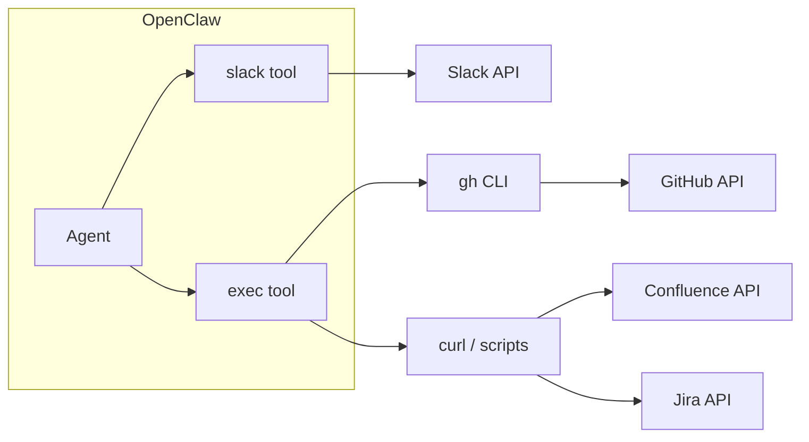

# Slack / Confluence / Jira / GitHub 読み取り — 実装プラン

再開時はこのファイルを参照して実装を続行する。**採用方針: 案A（Skills 中心）**。

---

## 現状の整理

| サービス | OpenClaw 標準 | 読み取りの現状 |
|----------|----------------|----------------|
| **Slack** | チャネル連携 + `slack` ツール | `readMessages`（直近メッセージ）は既存。検索・スレッド・履歴は要拡張 |
| **Confluence** | なし | REST API または MCP で対応が必要 |
| **Jira** | なし | REST API または MCP で対応が必要 |
| **GitHub** | なし（標準ツールなし） | 既存スキル `github` が `gh` CLI で issues/PR/API 読み取り可能 |

- **Skills**: `config/workspace/skills/` または `~/.openclaw/skills` に SKILL.md + 必要なら scripts/references。エージェントが「いつ・どう使うか」を学習し、既存ツール（exec, gateway, web_fetch 等）や外部 CLI を呼ぶ。
- **MCP**: 既存の `mcporter` スキルで MCP サーバーを呼べる。`mcporter call <server.tool>` でツール実行。設定は `config/mcporter.json`（または `--config`）でサーバー定義。
- **組み込みツール**: `slack`（reactions/messages/pins/memberInfo/readMessages）、`web_fetch`、`exec` 等。

---

## 案A: Skills 中心（REST API + 既存ツール） — 採用

Slack / GitHub は既存ツール・スキルを利用し、Confluence/Jira は「API の使い方」を書いた Skill で対応する。

- **Slack**: `channels.slack` 設定 + 既存の slack スキルで `readMessages` を利用。検索・スレッドまで必要なら、Slack API を curl で叩く手順を書いたスキルを追加（トークンは `skills.entries.slack.env` 等で注入）。
- **GitHub**: 既存スキル `github`（`gh` CLI）を有効化。`gh auth login` 済み、または `GH_TOKEN` を env で注入。issues/PR 一覧・詳細・CI ログ・`gh api` での REST 読み取りが可能。スキルがワークスペースに無ければ `config/workspace/skills/github/` に配置するか、ClawHub から導入。
- **Confluence**: 新規スキル（例: `confluence-read`）。SKILL.md に Confluence REST API（ページ取得・検索・CQL）の説明と curl 例、必要なら `scripts/fetch_page.sh` を同梱。認証は API トークン or OAuth を env で指定。
- **Jira**: 新規スキル（例: `jira-read`）。Jira REST API（issue 取得・JQL 検索）の説明と curl/スクリプト。認証は API トークン or OAuth。

**メリット**: 追加コンポーネントが少ない。既存の exec + env 注入で完結。  
**デメリット**: Confluence/Jira の複雑な API は SKILL.md とスクリプトのメンテが必要。

---

## 実装タスク（案A）

1. **GitHub**: `github` スキルをワークスペースに用意し有効化。Docker の場合は `gh` のインストール（apt/node）とトークン env を設定。
2. **Slack**: `channels.slack` 設定と既存 slack スキルの有効化。必要なら readMessages 以外（検索等）用の補足スキルを追加。
3. **Confluence**: `confluence-read` スキルを新規作成（SKILL.md + 認証・API 手順、必要なら scripts）。
4. **Jira**: `jira-read` スキルを新規作成（SKILL.md + 認証・API 手順、必要なら scripts）。
5. **設定**: `openclaw.json` の `skills.entries` に各スキルの enabled と env/apiKey を記載（トークンは env 経由）。

---

## 実装時の共通ポイント

- **認証**: いずれも API トークン or OAuth。OpenClaw では `skills.entries.<name>.env` や `skills.entries.<name>.apiKey` で注入し、SKILL.md やスクリプトから参照。トークンは設定ファイルに平文で書かず、env 経由にすること。
- **スキル配置**: ワークスペースで使う場合は `config/workspace/skills/` に配置（OPENCLAW_CONFIG_DIR 統合済みなら `config/workspace/skills/` がそのまま使われる）。全エージェント共通なら `~/.openclaw/skills`（コンテナでは config に skills をマウントするか、イメージに含める）。
- **Docker**: exec で curl や mcporter を叩く場合、コンテナ内に curl はほぼ必須。mcporter を使う場合は `OPENCLAW_DOCKER_APT_PACKAGES` や setupCommand で Node + mcporter を入れるか、ホストで mcporter を動かし node 経由で呼ぶ構成を検討する必要あり。

---

## 参考: 他案（案B・案C）

- **案B**: MCP サーバー + mcporter で Confluence/Jira を MCP ツール化。読み取りロジックの集約・他クライアント共有に向くが、MCP の用意・運用が必要。
- **案C**: Slack は標準のまま。Confluence/Jira は MCP があれば mcporter、なければスキルで REST API。

詳細は Cursor のプラン履歴（`.cursor/plans/`）を参照。
